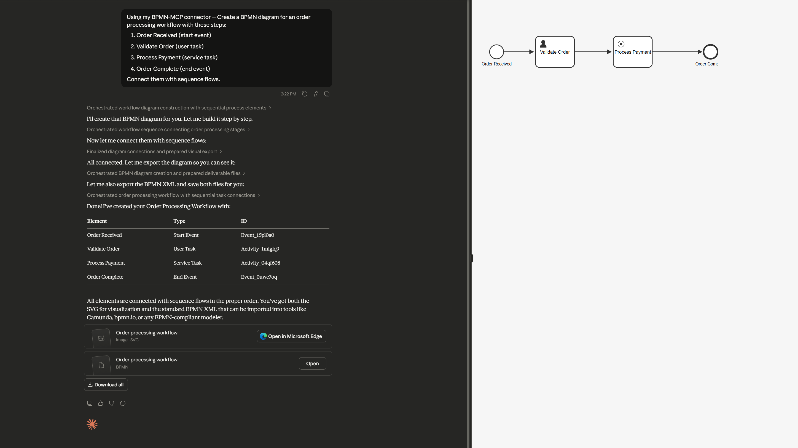
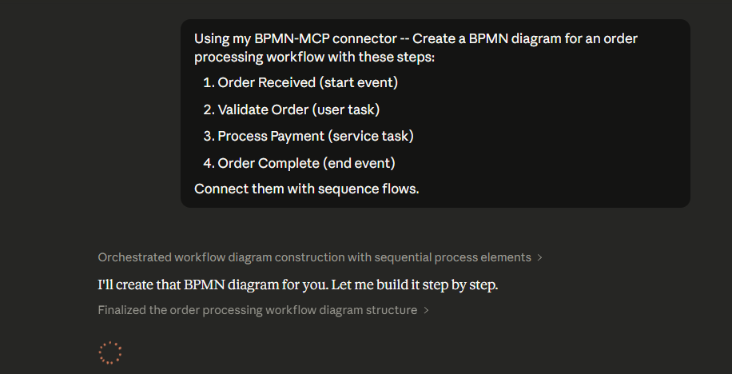

# BPMN-MCP

A Model Context Protocol (MCP) server for creating and manipulating BPMN 2.0 workflow diagrams programmatically. This server enables AI assistants and other tools to generate, edit, and export business process diagrams in the standard BPMN format.


[!WARNING] This fork is primarily developed with the assistance of AI coding agents.

## Features

- **Create BPMN Diagrams**: Generate new workflow diagrams from scratch
- **Add Process Elements**: Insert events, tasks, gateways, and subprocesses
- **Connect Elements**: Create sequence flows between workflow components
- **Export Formats**: Save diagrams as BPMN 2.0 XML or SVG
- **Import Support**: Load and modify existing BPMN XML files
- **BPMN Linting**: Integrated [bpmnlint](https://github.com/bpmn-io/bpmnlint) validation with 27+ rules — automatic feedback on mutating operations
- **Label Positioning**: Geometry-based label adjustment to prevent overlaps with connections and other labels
- **Camunda 7 Support**: Full Camunda extension properties (assignee, form keys, external tasks, etc.)
- **Smart Hints**: Get helpful nudges to ensure complete workflows with proper connections

## Installation

### Prerequisites

- Node.js (v16 or higher)
- npm or yarn

### Local Setup

1. Clone the repository:
```bash
git clone https://github.com/dattmavis/BPMN-MCP.git
cd BPMN-MCP
```

2. Install dependencies:
```bash
npm install
```

3. Build the project:
```bash
npm run build
```

## Configuration

### For Claude Desktop

Add the following to your Claude Desktop configuration file:

**macOS**: `~/Library/Application Support/Claude/claude_desktop_config.json`
**Windows**: `%APPDATA%\Claude\claude_desktop_config.json`

```json
{
  "mcpServers": {
    "bpmn": {
      "command": "node",
      "args": ["/absolute/path/to/BPMN-MCP/dist/index.js"]
    }
  }
}
```

Replace `/absolute/path/to/BPMN-MCP` with the actual path where you cloned this repository.

### For Other AI Tools

This MCP server works with any tool that supports the Model Context Protocol. Configure it to run:
```bash
node /path/to/BPMN-MCP/dist/index.js
```

## Usage

Once configured, you can ask your AI assistant to create BPMN diagrams. Here are some example requests:



### Creating a Simple Workflow

```
Create a BPMN diagram for an order processing workflow with these steps:
1. Order Received (start event)
2. Validate Order (user task)
3. Process Payment (service task)
4. Order Complete (end event)

Connect them with sequence flows.
```



### Creating a Workflow with Decision Points

```
Create a BPMN diagram for customer support ticket routing:
- Start: Ticket Received
- Task: Categorize Ticket
- Gateway: Check Priority
  - If High: Escalate to Senior Support
  - If Normal: Assign to Support Team
- Both paths lead to: Ticket Resolved (end)
```

## Available Tools (24)

The MCP server provides these tools:

### Core BPMN Tools
| Tool | Description |
|---|---|
| `create_bpmn_diagram` | Create a new BPMN diagram |
| `add_bpmn_element` | Add elements (events, tasks, gateways, subprocesses, participants, lanes) |
| `connect_bpmn_elements` | Connect elements with sequence/message flows or associations |
| `delete_bpmn_element` | Remove an element or connection |
| `move_bpmn_element` | Move an element to a new position |
| `list_bpmn_elements` | List all elements with positions and connections |
| `validate_bpmn_diagram` | Validate using bpmnlint (recommended + Camunda 7 compat + custom MCP rules) |
| `align_bpmn_elements` | Align elements along an axis |
| `distribute_bpmn_elements` | Evenly distribute elements |
| `export_bpmn` | Export as BPMN 2.0 XML or SVG |
| `import_bpmn_xml` | Import existing BPMN XML |

### Camunda 7 (Operaton) Tools
| Tool | Description |
|---|---|
| `set_element_properties` | Set standard and Camunda extension properties |
| `set_input_output_mapping` | Configure input/output parameter mappings |
| `set_event_definition` | Add error, timer, message, signal event definitions |
| `set_form_data` | Configure generated task forms (Camunda FormData) |
| `set_camunda_error_event_definition` | Set error handling on service tasks |
| `set_loop_characteristics` | Configure loop/multi-instance markers |

### Utility Tools
| Tool | Description |
|---|---|
| `get_element_properties` | Inspect all properties of an element |
| `delete_diagram` | Remove a diagram from memory |
| `list_diagrams` | List all in-memory diagrams |
| `clone_diagram` | Duplicate a diagram |
| `layout_diagram` | Auto-layout using bpmn-auto-layout |
| `lint_bpmn_diagram` | Lint with bpmnlint rules (full report with all severities) |
| `adjust_labels` | Adjust external labels to reduce overlap |

### Automatic Lint Feedback

All mutating tools (`add_bpmn_element`, `connect_bpmn_elements`, `delete_bpmn_element`, `set_element_properties`, etc.) automatically append bpmnlint error-level issues to their response. This gives AI callers immediate feedback when an operation introduces a rule violation.

### Default Lint Rules

The server uses a layered lint configuration extending three rule sets:
- **`bpmnlint:recommended`** — 27 standard BPMN validation rules
- **`plugin:camunda-compat/camunda-platform-7-24`** — Camunda 7 (Operaton) compatibility checks
- **`plugin:bpmn-mcp/recommended`** — Custom MCP rules (external task topic validation, gateway default flow checks)

With these adjustments for incremental AI-driven diagram construction:
- `label-required` → downgraded to warning (labels may be added incrementally)
- `no-disconnected` → downgraded to warning (diagrams are built step-by-step)
- `no-overlapping-elements` → disabled (false positives in headless mode)

Use the `lint_bpmn_diagram` tool with a custom config to override rules, or place a `.bpmnlintrc` JSON file in the working directory.

## Example Output

The server generates standard BPMN 2.0 XML files that can be opened in:
- [Camunda Modeler](https://camunda.com/download/modeler/)
- [bpmn.io](https://bpmn.io/)
- Any BPMN 2.0 compliant tool

Example XML output:
```xml
<?xml version="1.0" encoding="UTF-8"?>
<bpmn:definitions xmlns:bpmn="http://www.omg.org/spec/BPMN/20100524/MODEL"
                   xmlns:bpmndi="http://www.omg.org/spec/BPMN/20100524/DI"
                   xmlns:dc="http://www.omg.org/spec/DD/20100524/DC"
                   xmlns:di="http://www.omg.org/spec/DD/20100524/DI">
  <bpmn:process id="Process_1" isExecutable="true">
    <bpmn:startEvent id="Event_1" name="Start">
      <bpmn:outgoing>Flow_1</bpmn:outgoing>
    </bpmn:startEvent>
    <bpmn:task id="Task_1" name="Process">
      <bpmn:incoming>Flow_1</bpmn:incoming>
      <bpmn:outgoing>Flow_2</bpmn:outgoing>
    </bpmn:task>
    <bpmn:endEvent id="Event_2" name="End">
      <bpmn:incoming>Flow_2</bpmn:incoming>
    </bpmn:endEvent>
    <bpmn:sequenceFlow id="Flow_1" sourceRef="Event_1" targetRef="Task_1" />
    <bpmn:sequenceFlow id="Flow_2" sourceRef="Task_1" targetRef="Event_2" />
  </bpmn:process>
  <!-- Diagram information omitted for brevity -->
</bpmn:definitions>
```

## Development

### Running in Development Mode

```bash
npm run watch
```

This will rebuild the project automatically when source files change.

### Testing

You can test the server manually using the MCP protocol:

```bash
node dist/index.js
```

Then send JSON-RPC requests via stdin. Example:
```json
{"jsonrpc":"2.0","id":1,"method":"tools/list","params":{}}
```

## Technical Details

### Architecture

- **Runtime**: Node.js with TypeScript
- **BPMN Engine**: bpmn-js (headless mode with jsdom)
- **BPMN Linting**: bpmnlint with McpPluginResolver (27+ built-in rules, Camunda 7 compat, custom MCP rules)
- **Protocol**: Model Context Protocol (MCP)
- **Output**: BPMN 2.0 XML standard

### Smart Workflow Hints & Validation

The server includes helpful hints and automated validation:
- Reminds you to connect elements when adding tasks/events
- Warns when exporting diagrams with disconnected elements
- Automatic bpmnlint feedback after every mutating operation
- Camunda 7 (Operaton) compatibility checks via bpmnlint-plugin-camunda-compat
- Custom MCP rules (e.g. external task topic without type, missing gateway defaults)
- Geometry-based label positioning to avoid overlaps with connections

## License

MIT

## Contributing

Contributions are welcome! Please feel free to submit issues or pull requests.

## Support

For issues or questions:
- Open an issue on GitHub
- Check existing issues for solutions

## Related Projects

- [bpmn-js](https://bpmn.io/toolkit/bpmn-js/) - BPMN 2.0 rendering toolkit
- [Model Context Protocol](https://modelcontextprotocol.io/) - Protocol specification
