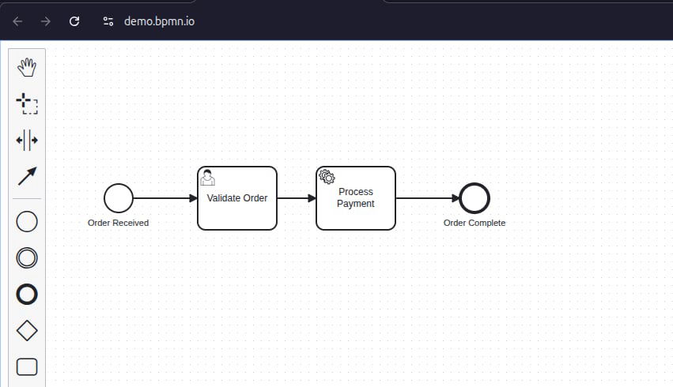

# BPMN-MCP

MCP server that lets AI assistants create and manipulate BPMN 2.0 workflow diagrams. Uses [bpmn-js](https://bpmn.io/toolkit/bpmn-js/) headlessly via jsdom to produce valid BPMN XML and SVG output with full [Camunda 7](https://docs.camunda.org/manual/7.24/) (Operaton) extension support.



> [!WARNING]
> This fork is primarily developed with the assistance of AI coding agents.

## Setup

### `./vscode/mcp.json`

```json
{
  "servers": {
    "BPMN-MCP": {
      "type": "stdio",
      "command": "npx",
      "args": ["git+https://github.com/datakurre/BPMN-MCP"]
    }
  }
}
```

## AI Agent Instructions

> **When working with `.bpmn` files, always use the BPMN MCP tools instead of editing BPMN XML directly.** The MCP tools ensure valid BPMN 2.0 structure, proper diagram layout coordinates, and semantic correctness that hand-editing XML cannot guarantee.

**To modify an existing `.bpmn` file**, use `import_bpmn_xml` to load it, make changes with the MCP tools, then `export_bpmn` and write the result back to the file.

**To create a new diagram**, use `create_bpmn_diagram`, build it with `add_bpmn_element` / `connect_bpmn_elements`, then `export_bpmn` to get the XML.

## Available Tools (24)

### Core BPMN Tools

| Tool                       | Description                                                               |
| -------------------------- | ------------------------------------------------------------------------- |
| `create_bpmn_diagram`      | Create a new BPMN diagram                                                 |
| `add_bpmn_element`         | Add elements (events, tasks, gateways, subprocesses, participants, lanes) |
| `connect_bpmn_elements`    | Connect elements with sequence/message flows or associations              |
| `delete_bpmn_element`      | Remove an element or connection                                           |
| `move_bpmn_element`        | Move an element to a new position                                         |
| `list_bpmn_elements`       | List all elements with positions and connections                          |
| `validate_bpmn_diagram`    | Validate using bpmnlint (recommended + Camunda 7 + custom MCP rules)      |
| `align_bpmn_elements`      | Align elements along an axis (with optional compaction)                   |
| `distribute_bpmn_elements` | Evenly distribute elements                                                |
| `export_bpmn`              | Export as BPMN 2.0 XML or SVG                                             |
| `import_bpmn_xml`          | Import existing BPMN XML                                                  |

### Camunda 7 Tools (Operaton BPM compatible)

| Tool                                 | Description                                         |
| ------------------------------------ | --------------------------------------------------- |
| `set_element_properties`             | Set standard and Camunda extension properties       |
| `set_input_output_mapping`           | Configure input/output parameter mappings           |
| `set_event_definition`               | Add error, timer, message, signal event definitions |
| `set_form_data`                      | Configure generated task forms (Camunda FormData)   |
| `set_camunda_error_event_definition` | Set error handling on service tasks                 |
| `set_loop_characteristics`           | Configure loop/multi-instance markers               |

### Utility Tools

| Tool                     | Description                                                |
| ------------------------ | ---------------------------------------------------------- |
| `get_element_properties` | Inspect all properties of an element                       |
| `delete_diagram`         | Remove a diagram from memory                               |
| `list_diagrams`          | List all in-memory diagrams                                |
| `clone_diagram`          | Duplicate a diagram                                        |
| `layout_diagram`         | Auto-layout using bpmn-auto-layout                         |
| `lint_bpmn_diagram`      | Lint with bpmnlint rules (full report with all severities) |
| `adjust_labels`          | Adjust external labels to reduce overlap                   |

### Automatic Lint Feedback

All mutating tools automatically append bpmnlint error-level issues to their response. This gives AI callers immediate feedback when an operation introduces a rule violation. The `lint_bpmn_diagram` tool returns all severities for a full report.

The default config extends `bpmnlint:recommended`, `plugin:camunda-compat/camunda-platform-7-24`, and `plugin:bpmn-mcp/recommended`, with `label-required` and `no-disconnected` downgraded to warnings for incremental construction.

## Output Compatibility

Generated BPMN 2.0 XML works with [Camunda Modeler](https://camunda.com/download/modeler/), [bpmn.io](https://bpmn.io/), and any BPMN 2.0 compliant tool.

## Development

```bash
npm run watch      # rebuild on change
npm run typecheck  # tsc --noEmit
npm run lint       # eslint
npm test           # vitest
```

See [AGENTS.md](AGENTS.md) for architecture details.

## License

MIT
