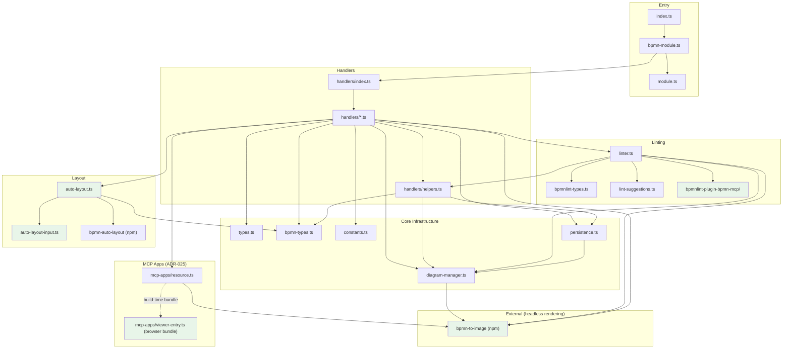

# Architecture

## Overview

BPMN-MCP is a Model Context Protocol (MCP) server that lets AI assistants create and manipulate BPMN 2.0 workflow diagrams. It uses `bpmn-js` running headlessly via `jsdom` (delegated to [`bpmn-to-image`](https://github.com/datakurre/bpmn-to-image)) to produce valid BPMN XML and SVG output.

## Module Dependency Diagram



## Module Boundaries

The project enforces strict dependency boundaries (via ESLint `no-restricted-imports`):

| Module                          | May import from                                 | Must NOT import from                     |
| ------------------------------- | ----------------------------------------------- | ---------------------------------------- |
| `src/auto-layout*.ts`           | `types.ts`, `bpmn-types.ts`, `bpmn-auto-layout` | `handlers/`, `bpmnlint-plugin-bpmn-mcp/` |
| `src/bpmnlint-plugin-bpmn-mcp/` | `bpmnlint`                                      | `handlers/`                              |
| `src/handlers/`                 | Everything above                                | _(no restrictions)_                      |

These rules keep the layout bridge and `bpmnlint-plugin-bpmn-mcp/` as independent leaf modules. The layout algorithm itself lives in the external [`bpmn-auto-layout`](https://github.com/datakurre/bpmn-auto-layout) package.

## Dependency Flow

```
Allowed dependency direction: top → bottom

  index.ts / bpmn-module.ts
           │
    handlers/index.ts
           │
    handlers/*.ts
      │    │    │
      │    │    └──► auto-layout.ts ──► bpmn-auto-layout (npm)
      │    │
      │    └──► linter.ts ──► bpmnlint-plugin-bpmn-mcp/
      │
      └──► diagram-manager.ts ──► bpmn-to-image (npm)
```

## Directory Layout

| Directory / File                | Responsibility                                                                                                |
| ------------------------------- | ------------------------------------------------------------------------------------------------------------- |
| `src/index.ts`                  | Entry point — wires MCP server, transport, and tool modules                                                   |
| `src/module.ts`                 | Generic `ToolModule` interface for pluggable editor back-ends                                                 |
| `src/bpmn-module.ts`            | BPMN tool module — registers tools and dispatches calls                                                       |
| `src/types.ts`                  | Shared interfaces (`DiagramState`, `ToolResult`, arg types)                                                   |
| `src/bpmn-types.ts`             | TypeScript interfaces for bpmn-js services                                                                    |
| `src/constants.ts`              | Centralised magic numbers (`STANDARD_BPMN_GAP`, `ELEMENT_SIZES`)                                              |
| `src/geometry.ts`               | Geometry utilities (rectangle overlap, label scoring)                                                         |
| `src/diagram-manager.ts`        | In-memory `Map<string, DiagramState>` store                                                                   |
| `src/linter.ts`                 | Centralised bpmnlint integration                                                                              |
| `src/lint-suggestions.ts`       | Fix suggestion generation for lint issues                                                                     |
| `src/bpmnlint-types.ts`         | TypeScript types for bpmnlint                                                                                 |
| `src/persistence.ts`            | Optional file-backed diagram persistence                                                                      |
| `src/tool-definitions.ts`       | Thin re-export of TOOL_DEFINITIONS                                                                            |
| `src/handlers/`                 | Handler files organised by domain (38 registered MCP tools)                                                   |
| `src/handlers/index.ts`         | Tool registry + dispatch map + re-exports                                                                     |
| `src/handlers/helpers.ts`       | Shared utilities barrel (validation, element access, etc.)                                                    |
| `src/handlers/core/`            | Diagram lifecycle: create, delete, clone, list, import, export, validate, batch, history, diff                |
| `src/handlers/elements/`        | Element CRUD: add, connect, delete, move, duplicate, insert, replace, list, get-properties                    |
| `src/handlers/properties/`      | Property setters: set-properties, set-input-output, set-event-definition, set-form-data, etc.                 |
| `src/handlers/layout/`          | Layout & alignment: layout-diagram, align-elements, label adjustment                                          |
| `src/handlers/collaboration/`   | Collaboration: create-participant, create-lanes, assign-to-lane, wrap-process, handoff, etc.                  |
| `src/auto-layout.ts`            | Bridge to `bpmn-auto-layout`: runs the library and applies its DI as one undoable command                     |
| `src/auto-layout-input.ts`      | Prepares library input: boundary-event lane sync, element-subset extraction                                   |
| `src/bpmnlint-plugin-bpmn-mcp/` | Custom bpmnlint plugin with Camunda 7 rules                                                                   |
| `src/mcp-apps/resource.ts`      | Serves the `ui://bpmn-diagram-viewer` MCP Apps HTML resource (Node)                                           |
| `src/mcp-apps/host-support.ts`  | Detects MCP Apps hosts from their `initialize` capabilities (Node)                                            |
| `src/mcp-apps/viewer-entry.ts`  | Browser-side MCP Apps View script — separate esbuild/tsconfig target, never bundled into the server (ADR-025) |

## Where to Put New Code

```
Need to add…                         → Put it in…
─────────────────────────────────────────────────────────────────
A new MCP tool                       → src/handlers/<domain>/<name>.ts
                                       (export handler + TOOL_DEFINITION,
                                        add to TOOL_REGISTRY in index.ts)

A shared handler utility             → src/handlers/helpers.ts barrel
                                       (or a new sub-module re-exported from it)

A new bpmnlint rule                  → src/bpmnlint-plugin-bpmn-mcp/rules/

A layout algorithm improvement       → github.com/datakurre/bpmn-auto-layout
How layout results are applied       → src/auto-layout.ts

A new bpmn-js type/interface         → src/bpmn-types.ts

A new shared constant                → src/constants.ts

A polyfill for headless bpmn-js      → github.com/datakurre/bpmn-to-image
                                       (headless canvas, polyfills, SVG/PNG
                                        rendering all live there now)

A tool eligible for the MCP Apps     → add/remove it from
diagram viewer                        MCP_APP_VIEW_EXCLUDED_TOOLS in
                                       src/handlers/index.ts
```

## Core Patterns

1. **Headless bpmn-js via jsdom** — Delegated to [`bpmn-to-image`](https://github.com/datakurre/bpmn-to-image), which owns the shared `jsdom` instance, browser API polyfills, and SVG/PNG rendering. `src/diagram-manager.ts` builds its modeler on top of the library's `createModeler()` (see [ADR-022](../agents/adrs/ADR-022-bpmn-to-image-library.md)).

2. **In-memory diagram store** — Diagrams live in a `Map<string, DiagramState>` keyed by generated IDs. Optional file-backed persistence can be enabled.

3. **Co-located tool definitions** — Each handler file exports both the handler function and its `TOOL_DEFINITION` schema, preventing definition drift (see [ADR-001](../agents/adrs/ADR-001-co-located-tool-definitions.md)).

4. **Unified tool registry** — The `TOOL_REGISTRY` array in `src/handlers/index.ts` is the single source of truth. Both `TOOL_DEFINITIONS` and the dispatch map are auto-derived from it.

5. **Camunda moddle extension** — `camunda-bpmn-moddle` is registered on every modeler instance, enabling Camunda-specific attributes.

6. **Implicit lint feedback** — Mutating handlers call `appendLintFeedback()` to surface error-level lint issues in their response.

7. **Export lint gate** — `export_bpmn` blocks export when error-level lint issues exist, unless `skipLint: true` is passed.

8. **Library-based layout** — Layout is delegated to [`bpmn-auto-layout`](https://github.com/datakurre/bpmn-auto-layout) (XML in, XML with DI out). `src/auto-layout.ts` exports the modeler's XML, runs the library, and applies the resulting shape bounds, waypoints and label bounds through `modeling` commands wrapped in one compound command, so a layout is a single undo step. Partial layout: `scopeElementId` takes one participant/subprocess from a full layout and keeps it anchored; `elementIds` lays out a pruned copy of the process holding only the chosen siblings. Connections crossing the boundary of a partial layout are re-routed with `modeling.layoutConnection()`. See [ADR-020](../agents/adrs/ADR-020-bpmn-auto-layout-library.md).

9. **Label adjustment** — Geometry-based scoring positions external labels away from connection paths to reduce visual overlap.

10. **MCP Apps diagram viewer** — For hosts that advertise the `io.modelcontextprotocol/ui` extension in `initialize`, mutating tools declare `_meta.ui.resourceUri: 'ui://bpmn-diagram-viewer'` and `appendMcpAppContent()` embeds the diagram's XML as an `audience: ["user"]` resource content item in their results, for the View to render inline. See [ADR-025](../agents/adrs/ADR-025-mcp-apps-diagram-viewer.md).
